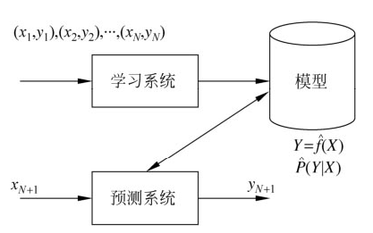
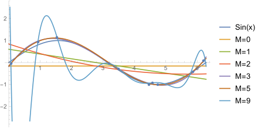
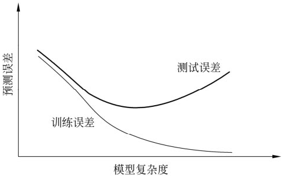

<!-- TOC -->

- [第0章 重点索引](#第0章-重点索引)
- [第1章 统计学习方法概论](#第1章-统计学习方法概论)
    - [1.2  监督学习  supervised learning](#12--监督学习--supervised-learning)
        - [1.2.1 基本概念](#121-基本概念)
            - [输入空间、特征空间、输出空间](#输入空间特征空间输出空间)
            - [联合概率分布](#联合概率分布)
            - [假设空间](#假设空间)
        - [1.2.2 问题的形式化](#122-问题的形式化)
    - [1.3 统计学习三要素](#13-统计学习三要素)
        - [1.3.1 模型](#131-模型)
            - [假设空间可以定义为决策函数的集合](#假设空间可以定义为决策函数的集合)
            - [假设空间可以定义为条件概率的集合](#假设空间可以定义为条件概率的集合)
        - [1.3.2 策略](#132-策略)
            - [损失函数、风险函数](#损失函数风险函数)
            - [经验风险最小化、结构风险最小化](#经验风险最小化结构风险最小化)
        - [1.3.3 算法](#133-算法)
    - [1.4 模型评价与模型选择](#14-模型评价与模型选择)
        - [1.4.1 训练误差与测试误差](#141-训练误差与测试误差)
        - [1.4.2 过拟合与模型选择](#142-过拟合与模型选择)
    - [1.5 正则化与交叉验证](#15-正则化与交叉验证)
        - [1.5.1 正则化](#151-正则化)
        - [1.5.2 交叉验证](#152-交叉验证)
            - [简单交叉验证](#简单交叉验证)
            - [S折交叉验证](#s折交叉验证)
            - [留一交叉验证](#留一交叉验证)
    - [1.6 泛化能力](#16-泛化能力)
        - [1.6.1 泛化误差](#161-泛化误差)
        - [1.6.2 泛化误差上界](#162-泛化误差上界)

<!-- /TOC -->
___
# 第0章 重点索引

[多项式曲线拟合 Polynomial Curve Fitting](#fomula1_18)
[定理1.1（泛化误差上界）](#theorem1_1)

# 第1章 统计学习方法概论

## 1.2  监督学习  supervised learning

### 1.2.1 基本概念

#### 输入空间、特征空间、输出空间

每个具体的输入是一个实例(instance)，通常有特征向量(feature vector)表示。所有特征向量所在的空间即为特征空间(feature space)。

本书中 向量均为**列向量**。  
输入实例$x$的特征向量记作$\vec{x}=(x^{(1)},x^{(2)},...,x^{(i)},...,x^{(n)})^{T}$，  
而$x^{(i)}$和$x_{i}$不同，即$\vec{x_{i}}=(x^{(1)}_{i},x^{(2)}_{i},...,x^{(n)}_{i})^{T}$。  

训练集由输入(或特征向量)与输出对组成 $T=\{(x_{1},y_{1}),(x_{2},y_{2}),...(x_{N},y_{N})\}$, 输入输出对又称为样本(sample)。  

| 输入变量 | 输出变量 | 预测任务 |
| :------: | :------: | :------: |
| 连续变量 | 连续变量 | 回归问题 |
|          | 离散变量 | 分类问题 |
| 变量序列 | 变量序列 | 标注问题 |

#### 联合概率分布

监督学习假设输入输出随机变量最受联合概率分布$P=(X,Y)$,训练数据与测试数据看作是依此分布[iid](../../Statistical_theory/Independent_and_identically_distributed_random_variables.md)产生的。

#### 假设空间

 模型$\in$假设空间(hypothesis space)$=$即*输入空间到输出空间的映射的集合*，假设空间确定意味着学习范围的确定。

监督学习的模型可以是概率模型或非概率模型，由条件概率分布$P(Y|X)$或决策函数（decisionfunction）$Y=f(X)$表示，随具体学习方法而定。对具体的输入进行相应的输出预测时，写作$P(y|x)$或$Y=f(x)$。

### 1.2.2 问题的形式化

*图1.1 监督学习问题*

在学习过程中得到一个模型，表示为条件概率分布$\hat{P}(Y|X)$或决策函数$Y=\hat{f}(X)$,其描述了输入输出r.v.的映射关系。  
在预测过程中，预测系统对于给定 的测试样本集中的输入$x_{N+1}$，由模型$y_{N+1}=\arg \underset{y_{N+1}}{\max} \hat{P}(y_{N+1}|x_{N+1})$或$y_{N+1}=\hat{f}(x_{N+1})$给出相应的输出$y_{N+1}$。

## 1.3 统计学习三要素

**
方法=模型+策略+算法
**

### 1.3.1 模型

模型的<u>**假设空间**</u>(hypothesis sapce)包含所有可能的条件概率分布或决策函数。  
$X$和$Y$是定义在输入空间$\mathcal{X}$和输出空间$\mathcal{Y}$的变量或随机变量。
参数向量$\theta$取值于$n$维欧式空间$\mathbf{R}^{n}$,称为<u>**参数空间**</u>(parameter sapce)。

#### 假设空间可以定义为决策函数的集合 

$$\mathcal{F}=\{ f|Y=f(X)\}$$   
$(1.1)$
  

这时$\mathcal{F}$通常是由一个参数向量决定的函数族
$$\mathcal{F}=\{ f|Y=f_{\theta}(X),\theta\in\mathbf{R}^{n}\}$$ 
$(1.2)$
  

#### 假设空间可以定义为条件概率的集合

$$\mathcal{F}=\{ P|P(Y|X)\}$$   
$(1.3)$
  
这时$\mathcal{F}$通常是由一个参数向量决定的条件概率分布族
$$\mathcal{F}=\{ P|P_{\theta}(Y|X),\theta\in\mathbf{R}^{n}\}$$   
$(1.4)$
  

### 1.3.2 策略

统计学习的目标在于从假设空间中选取最优模型。

#### 损失函数、风险函数

损失函数$L(Y,f(X))$是一个非负实值函数，常用的函数有以下几种：

1. 0-1损失函数  0-1 loss function

$$L(Y,f(X)) = \begin{cases}
   1, &Y\not = f(X)  \\
   0, &Y     = f(X)
\end{cases}$$   
$(1.5)$
  

2. 平方损失函数 quadratic loss function

$$L(Y,f(X))=(Y-f(X))^2$$    
$(1.6)$

3. 绝对损失函数 absolute loss function

$$L(Y,f(X))=|Y-f(X)|$$  
$(1.7)$

4. 对数似然损失函数 loglikelihood loss function

$$L(Y,P|P(Y|X))=-\log P(Y|X)$$  
$(1.8)$

由于$(X,Y)$是遵循联合分布$P(X,Y)$的随机变量，所以损失函数的期望即是<u>**风险函数**</u> risk function 或 <u>**期望损失**</u> expect loss. 
[Statistical theory → Mean](../../Statistical_theory/Mean.md)
$$R_{exp}(f)=E_{p}[L(Y,f(X))]=\int_{\mathcal{X} \times \mathcal{Y}} L(y,f(x)) P(x,y) \text{d}x \text{d}y$$  
$(1.9)$

模型$f(X)$关于训练数据集$T=\{(x_{1},y_{1}),(x_{2},y_{2}),...(x_{N},y_{N})\}$的平均损失成为<u>**经验风险**</u>或<u>**经验损失**</u>，即
$$R_{emp}(f)=\frac{1}{N}\sum^{N}_{i=1}L(y_{i},f(x_{i}))$$    
$(1.10)$

期望风险$R_{exp}(f)$是模型关于联合分布的期望损失  
经验风险$R_{emp}(f)$是模型关于训练样本的平均损失  
根据大数定律，当样本容量$N\rightarrow \infty$时，经验风险$R_{emp}(f)$趋于期望风险$R_{exp}(f)$。
但是现实中训练样本数目有限，所以要对经验风险进行一定的矫正，这就关系到监督学习的两个基本策略:<u>**经验风险最小化**</u>和<u>**结构风险最小化**</u>

#### 经验风险最小化、结构风险最小化
 
在假设空间、损失函数、训练数据集确定的情况下，[经验风险函数式][1.10]就可以得到确定，经验风险最小化(empirical risk minimization, ERM)的策略认为，经验风险最小的模型是最优的模型。据此 按照经验风险最小化求最优模型就是求解最优化问题
$$\underset{f \in \mathcal{F}}{\min} R_{emp}(f)=\underset{f \in \mathcal{F}}{\min} \frac{1}{N} \sum^{N}_{i=1} L(y_{i},f(x_{i}))$$   
$(1.11)$
  

当模型是条件概率分布，损失函数是对数损失函数时，**经验风险最小化就等价于极大似然估计**。但是，当样本容量很小时，经验风险最小化学习的效果就未必很好，会产生后面将要叙述的<u>**过拟合**</u>(over-fitting)现象。

结构风险最小化（structural risk minimization，SRM）是为了防止过拟合而提出来的策略。结构风险最小化等价于<u>**正则化**</u>（regularization）。结构风险在经验风险上加上表示模型复杂度的**正则化项**（regularizer）或**罚项**（penaltyterm）。在假设空间、损失函数以及训练数据集确定的情况下，结构风险的定义是

$$\begin{aligned}
   R_{srm}(f) &=R_{emp}(f) &+\lambda J(f) \\
   &=\frac{1}{N}\sum^{N}_{i=1}L(y_{i},f(x_{i}))&+\lambda J(f) 
\end{aligned}$$ 
$(1.12)$
  

其中$J(f)$为模型的复杂度，是定义在假设空间上的泛函。模型$f$越复杂，复杂度$J(f)$就越大；反之，模型f越简单，复杂度J(f)就越小。也就是说，复杂度表示了对复杂模型的惩罚。$\lambda ≥ 0$是系数，用以权衡经验风险和模型复杂度。结构风险小需要经验风险与模型复杂度同时小。结构风险小的模型往往对训练数据以及未知的测试数据都有较好的预测。

- [ ] 贝叶斯估计中的最大后验概率估计（ maximum posterior probability estimation， MAP）

### 1.3.3 算法

统计学习问题归结为最优化问题，统计学习的算法成为求解最优化问题的算法。通常解析解不存在，这就需要用数值计算的方法求解。

## 1.4 模型评价与模型选择

### 1.4.1 训练误差与测试误差

注意，统计学习方法具体采用的损失函数未必是评估时使用的损失函数。当然，让两者一致是比较理想的。

假设学习到的模型是$Y=\hat{f}(X)$， 训练误差是此模型关于训练数据集的平均损失：
$$ R_{emp}(\hat{f})=\frac{1}{N}\sum^{N}_{i=1}L(y_{i},\hat{f}(x_{i}))$$ 
$(1.14)$
  

$N$ 训练样本容量
$N'$测试样本容量

例如， 当损失函数是0-1损失时，测试误差就变成了常见的测试数据集上的**误差率（error rate）**
$$ e_{test}(\hat{f})=\frac{1}{N'}\sum^{N'}_{i=1}I(y_{i} \neq \hat{f}(x_{i}))$$ 
$(1.16)$
  
$I$是指示函数（inficator function），即$y_{i} \neq \hat{f}(x_{i})$时为1。

显然$r_{test}+e_{test}=1$，$r_{test}$为测试数据集上的准确率（accuracy）。

通常将学习方法对未知数据的预测能力称为 **泛化能力（generalization ability）**。

### 1.4.2 过拟合与模型选择

**例1.1** 有数据集$T=\{(x_{1},y_{1}),(x_{2},y_{2}),\dots,(x_{N},y_{N})\}$  
其中，$x_{i},y_{i}\in \mathbb{R}$是输入$x$和输出$y$的观测值。假设给定数据由$M$次多项式函数生成，选择一个对已知数据以及未知数据都有很好预测能力的函数。
设$M$次多项式为  
$$f_{M}(x,w)=w_{0}+w_{1}x+w_{2}x^{2}+ \dots +w_{M}x^{M}=\sum^{M}_{j=0}w_{j}x^{j}$$
其中x是单变量输入。

求以下经验风险最小化：

$$\begin{aligned}
    L(w)
    &=\frac{1}{2}\sum^{N}_{i=1}(f(x_{i},w)-y_{i})^{2} \\
    &=\frac{1}{2}\sum^{N}_{i=1}(\sum^{M}_{j=0}w_{j}x^{j}_{i}-y_{i})^{2} 
\end{aligned}$$ 
$(1.18)$

$$\begin{aligned}
    \frac{\partial L(w)}{\partial w_{j}} 
    &=\frac{1}{2}\sum^{N}_{i=1}(2(\sum^{M}_{j=0}w_{j}x^{j}_{i}-y_{i}) x^{j}_{i})  \\
    &=\sum^{N}_{i=1}(f(x_{i},w)x^{j}_{i}-x^{j}_{i}y_{i}) \xlongequal{set}0\\
    \sum^{N}_{i=1}f(x_{i},w)x^{j}_{i} &= \sum^{N}_{i=1}x^{j}_{i}y_{i},\;\;\;\;\;j=0,1,2,\dots,M \\
    \;\\
    \sum^{N}_{i=1}f(x_{i},w) &= \sum^{N}_{i=1}y_{i}  \;\;\Rightarrow\;\;  w_{0}M + w_{1}\sum^{N}_{i=1}x^{1}_{i}+\dots + w_{M}\sum^{N}_{i=1}x^{M}_{i} = \sum^{N}_{i=1}y_{i} \\
    \vdots\\
    \sum^{N}_{i=1}f(x_{i},w)x^{k}_{i} &= \sum^{N}_{i=1}x^{k}y_{i}  \;\;\Rightarrow\;\;  w_{0}x^{k} + w_{1}\sum^{N}_{i=1}x^{k+1}_{i}+\dots + w_{M}\sum^{N}_{i=1}x^{k+M}_{i} = \sum^{N}_{i=1}x^{k}_{i}y_{i} \\
    \vdots\\
    \sum^{N}_{i=1}f(x_{i},w)x^{M}_{i} &= \sum^{N}_{i=1}x^{M}y_{i}  \;\;\Rightarrow\;\;  w_{0}x^{M} + w_{1}\sum^{N}_{i=1}x^{M+1}_{i}+\dots + w_{M}\sum^{N}_{i=1}x^{2M}_{i} = \sum^{N}_{i=1}x^{M}_{i}y_{i}  \\
    & \mathbf{set} \;\;\;\;\;\; g(j)=\sum^{N}_{i=1}x^{j}_{i},\;\;\;h(j)=\sum^{N}_{i=1}x^{j}_{i}y_{i} \\
    &\begin{pmatrix}
    g(0) & g(1) & \dots & g(k) & \dots & g(M) \\ 
    g(1) & g(2) & \dots & g(1+k) & \dots & g(1+M) \\ 
    \vdots & \vdots & \ddots & \vdots & \ddots & \vdots\\
    g(k) & g(k+1) & \dots & g(2k) & \dots & g(k+M) \\ 
    \vdots & \vdots & \ddots & \vdots & \ddots & \vdots\\
    g(M) & g(M+1) & \dots & g(M+k) & \dots & g(2M) 
    \end{pmatrix}
    \begin{pmatrix}
    w_{0}\\ 
    w_{1}\\
    \vdots \\ 
    w_{k}\\ 
    \vdots \\
    w_{M}
    \end{pmatrix}
    =
    \begin{pmatrix}
    h(0)\\ 
    h(1)\\
    \vdots \\ 
    h(k)\\ 
    \vdots \\
    h(M)
    \end{pmatrix}
\end{aligned}$$  

于是求得拟合多项式系数$w^{*}_{0},w^{*}_{1},\dots,w^{*}_{M}$

*图1.2 M次多项式函数拟合*

*图1.3 训练误差和测试误差与模型复杂度的关系*

当选择的模型复杂度过大时，过拟合现象就会发生。

在学习时就要防止过拟合，进行最优的模型选择，即选择复杂度适当的模型，以达到使测试误差最小的学习目的。下面介绍两种常用的模型选择方法：**正则化** 与 **交叉验证**。

## 1.5 正则化与交叉验证
### 1.5.1 正则化

正则化是结构风险最小化策略的实现，是在经验风险上加一个 **正则化项（regularizer）** 或 **罚项(penalty term)**。正则化项一般是模型复杂度的单调递增函数，模型越复杂，正则化值就越大。
比如，<u>正则化项可以是模型参数向量的范数</u>。
比如，回归问题中，损失函数是平方损失，正则化项可以是参数向量的$L_{2}$范数(即欧氏距离 $\left \| x \right \|^{2}=\sqrt{\sum^{n}_{i=1}x^{2}_{i}}$)：
$$L(w)=\frac{1}{N}\sum^{N}_{i=1}(f(x_{i};w)-y_{i})^{2}+\frac{\lambda}{2}\left \| w \right \|^{2}$$
也可以是参数向量的$L_{1}$范数($\left \| x \right \|_{1}=\sum^{n}_{i=1}\left |  x\right |$)：
$$L(w)=\frac{1}{N}\sum^{N}_{i=1}(f(x_{i};w)-y_{i})^{2}+\lambda\left \| w \right \|_{1}$$
 
从贝叶斯估计的角度来看，**正则化项对应于模型的先验概率**。可以假设复杂的模型有较小的先验概率，简单的模型有较大的先验概率。

### 1.5.2 交叉验证

#### 简单交叉验证
#### S折交叉验证
#### 留一交叉验证

## 1.6 泛化能力

### 1.6.1 泛化误差

如果学到的模型是$\hat{f}$，那么用这个模型对未知数据预测的误差即为 **泛化误差（generalization error）**
$$R_{exp}(\hat{f})=E_{p}[L(Y,\hat{f}(X))]=\int_{\mathcal{X}\times\mathcal{Y}} L(Y,\hat{f}(X)) P(x,y) \text{d}x \text{d}y$$ 
$(1.20)$
 

>*事实上， 泛化误差就是所学习到的模型的[期望损失].。*

具体来说，就是通过比较两种学习方法的泛化误差上界的大小来比较它们的优劣。泛化误差上界通常具有以下性质：它是样本容量的函数，当样本容量增加时，泛化上界趋于0；它是假设空间容量（capacity）的函数，假设空间容量越大，模型就越难学，泛化误差上界就越大。

### 1.6.2 泛化误差上界

**泛化误差上界上界（generalization error bound）** 通常具有以下性质：
它是样本容量的函数，当样本容量增加时，泛化上界趋于0；
它是假设空间容量（capacity）的函数，假设空间容量越大，模型就越难学，泛化误差上界就越大。

例子： <u>二类分类问题</u>的泛化误差上界。

已知训练数据集$T=\{(x_{1},y_{1}),(x_{2},y_{2}),\dots,(x_{N},y_{N})\}$，它是从联合概率分布$P(X,Y)$独立同分布产生的，$X\in R_{n},Y\in \{-1,+1\}$。假设空间是函数的有限集合$\mathcal{F}=\{f_{1},f_{2},\dots,f_{d}\}$，$d$是函数个数。设$f$是$\mathcal{F}$从中选取的函数。损失函数是$0-1$损失。关于$f$的期望风险和经验风险分别是

$$\begin{aligned}
    R(f)&=E[L(Y,f(X))] \\
    \hat{R}(f)&=\frac{1}{N}\sum^{N}_{i=1}L(y_{i},f(x_{i})) \\
    f_{N}&=\arg  \underset{f\in \mathcal{F}}{\min} \hat{R}(f)
\end{aligned}$$
$f_{N}$的泛化能力：
$$R(f_{N})=E[L(Y,f_{N}(X))]$$  
$(1.24)$
 

**
定理1.1（泛化误差上界）
** 
对二类分类问题，当假设空间是有限个函数的集合$\mathcal{F}=\{f_{1},f_{2},\dots,f_{d}\}$时，对任意一个函数$f\in \mathcal{F}$，至少以概率$1-\delta$，以下不等式成立：
$$\begin{aligned}
    generalization \; error \;\; & \leqslant & training\;error \;\; &+& \varepsilon(d,N,\delta) \\
     R(f)                   \;\; & \leqslant & \hat{R}(f)      \;\; &+& \sqrt{\frac{1}{2N}(\log d + \frac{1}{\delta})} 
\end{aligned}$$

[期望损失]:#fomula1_9 "(1.9)"
[1.10]:#fomula1_10 "(1.10)"